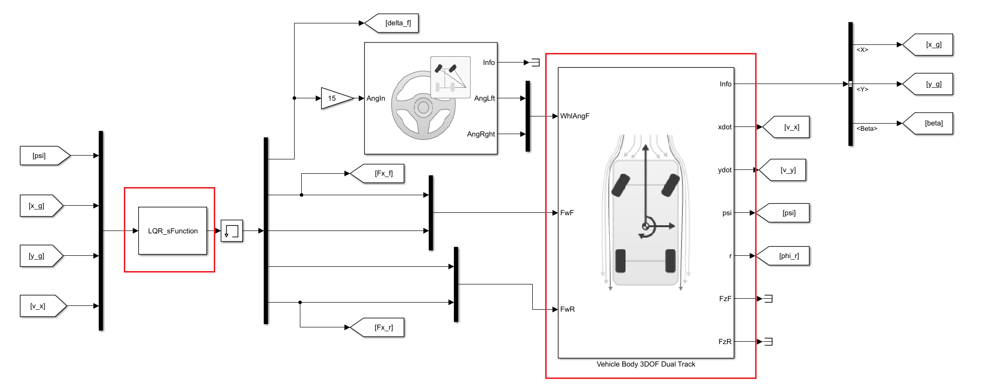
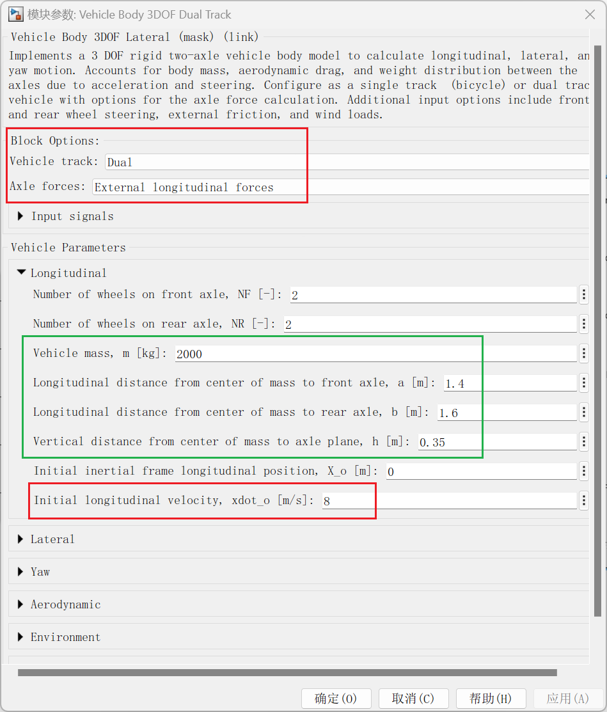
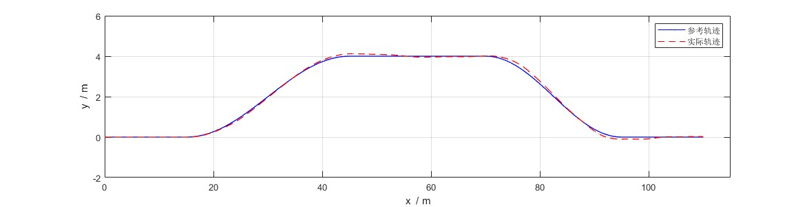
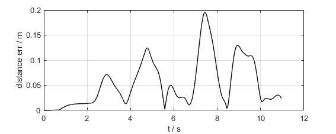
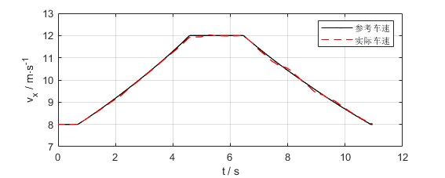
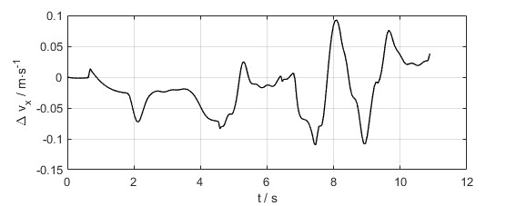
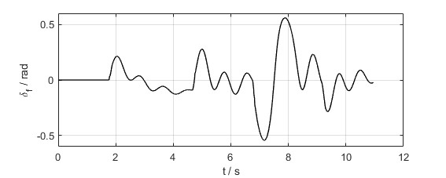
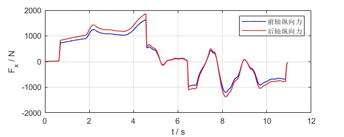
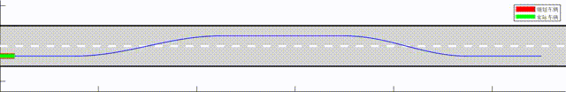

# 1 组合控制任务与控制算法简介

- 控制任务说明
    组合控制任务指真正的轨迹跟踪控制，要求车辆在在指定的时刻出现在指定的位置。通常横向控制是路径跟踪控制，纵向控制是对车速的控制，同时考虑两者并满足要求就能实现轨迹跟踪的组合控制任务。
- LQR控制器简介
    LQR (Linear Quadratic Regulator)即线性二次型调节器，LQR可得到状态线性反馈的最优控制规律，易于构成闭环最优控制。LQR算法将线性系统的控制问题转换成二次优化问题，并无限时间的二次型调节器能通过理论计算得到优化问题的解析表达式，因此在线求解运算量较小。

# 2 本地运行

## 2.1 软件准备

本项目可运行在MATLAB R2022a及以上版本，需安装完整的Simulink工具箱。

## 2.2 文件说明

- `reference.mat`为参考轨迹数据，包含时间戳`t_ref`,x坐标`x_ref`,y坐标`y_ref`三个变量。参考轨迹通常由上游决策规划模块生成。

- `Sim_Demo.slx`为Simulink文件，用于图形化编程及仿真运行。主要包括整体控制框架和被控对象模型等。

- `LQR_sFunction.m`控制器s函数文件，LQR控制算法代码编写在该文件中。

- `evaluator.mlx`后处理部分代码在该文件中，包括轨迹、误差、车辆状态参数曲线的绘制，动画演示。
  
  ## 2.3 操作步骤
  
  ### 2.3.1 准备

- 下载项目并解压，将MATLAB的工作路径设置为该文件夹；
    

- 或将文件夹中的文件复制到当前文件夹下。
  
  ### 2.3.2 运行文件

- 双击`Sim_Demo.slx`文件，并等待启动Simulink。

- 点击`运行`按钮开始仿真。
    

- 运行结束后，后在工作目录下会生成`reference_processed.mat`和 `Sim_result.mat`两个数据文件。`reference_processed.mat`为仿真时控制器为减少重复计算，初始化计算产生的中间数据。`Sim_result.mat`为仿真结果数据。
  
  ### 2.3.3 后处理运行结果

- 仿真结束后，需要对结果进行可视化绘图。双击 `evaluator.mlx`。

- 在`实时编辑器`选项卡下，按顺序点击`运行节`，查看每一节的运行结果。
    

# 3 代码解析与算法推导

## 3.1 仿真模型说明

如图，仿真模型分成控制器和被控对象两部分。控制器由s-函数编写而成，被控车辆是MATLAB提供的三自由度车辆模型，模型框图如下


- 组合控制的设置参数如下图，红框中需要进行设置。
  
  - 设置车辆为双轨模型，即左右车轮可以给定不同的参数，在转向时需要考虑阿克曼转角关系。驱动上给四个车轮的纵向力，理论上可以实现纵向力前后及左右的分配策略。
  - 设置车辆初始速度为8m/s，防止起步目标突变带来的问题。

- 绿框中的参数可以读取记下，后续控制器设计时的参数。
  
  
  ## 3.2 控制器推导

### 3.2.1 LQR控制算法

LQR控制器用s函数编写，主要用到输出模块和初始化模块，其主函数为

```matlab
function [sys,x0,str,ts]=LQR_sFunction(t,x,u,flag)

switch flag
    case 0
        [sys,x0,str,ts]=mdlInitializeSizes;
    case 3
        sys=mdlOutputs(t,x,u);
    case {1, 2, 4, 9}
        sys = [];
    otherwise
        error(['Unhandled flag = ',num2str(flag)]);
end

end
```

LQR控制器需要基于一个线性的模型，然后在模型的基础上，对输入和误差设目标标函数，构造一个优化问题。本质上控制的输入是一个序列，输出是目标函数的指标，因此优化问题是一个泛函极值问题。得益于目标函数二次和积分的形式，该泛函问题通过变分法可以进行求解。最优解可以通过求解一个黎卡提微分方程得到。对于线性定常系统的无限时间调节器，黎卡提方程进一步可以退化为代数黎卡提方程。因此在控制器中，只需要在线求解代数黎卡提方程并计算输出就能得输出的解析表达式。该表达式为一些简单的矩阵运算就能得到控制量。

首先建立控制模型，全局坐标系中，以后轮轴中心为参考点，车辆的运动学方程可表示为

$$
\begin{cases}
\dot X=v\cdot \cos(\varphi)\\
\dot Y = v \cdot \sin(\varphi) \\
\dot \varphi =v\cdot \tan(\delta)/L \\
\dot v = a_x
\end{cases}
$$

式中$X,Y,v,\varphi$为系统状态，$\delta,a_x$为控制量
将LQR控制，顾名思义需要作用到线性模型上。因此需要将模型线性化，将非线性方程在参考点$[X_r,Y_r,\varphi_r,v_r,\delta_r,a_{xr}]$泰勒展开到一阶得到扰动量的线性化模型

$$
\left[
\begin{matrix}
\dot X - \dot X_r \\
\dot Y - \dot Y_r \\
\dot \varphi - \dot \varphi_r \\
\dot v - \dot v_r \\
\end{matrix}
\right]
=
\left[
\begin{matrix}
0 & 0 & -v_r \sin\varphi_r & \cos\varphi_r \\
0 & 0 & v_r \cos\varphi_r & \sin\varphi_r \\
0 & 0 & 0 & \frac{tan\delta_r}{L} \\
0 & 0 & 0 & 0\\
\end{matrix}
\right]
\left[
\begin{matrix}
 X -  X_r \\
 Y -  Y_r \\
 \varphi - \varphi_r \\
v - v_r
\end{matrix}
\right]
+
\left[
\begin{matrix}
0 & 0 \\
0 & 0 \\
0 & \frac{v_r}{L\cdot \cos^2\delta_r} \\
1 & 0 \\
\end{matrix}
\right]
\left[
\begin{matrix}
a_x - a_{xr} \\
\delta - \delta_r \\
\end{matrix}
\right]
$$

定义扰动量

$$
\tilde{\mathcal{X}}=
\left[
\begin{matrix}
 X -  X_r \\
 Y -  Y_r \\
 \varphi - \varphi_r \\
v - v_r \\
\end{matrix}
\right],
\tilde u =
\left[
\begin{matrix}
 a_x -  a_{xr} \\
 \delta -  \delta_r \\
\end{matrix}
\right]
$$

参考量中$X_r$和$Y_r$直接可以通过时间索引到，而参考横摆角计算公式为

$$
\varphi_r(k) = \arctan\left(\frac{Y_r(k)-Y_r(k-1)}{X_r(k)-X_r(k-1)}\right)
$$

参考车速计算公式为

$$
v_r(k)=\frac{\sqrt{[X_r(k)-X_r(k-1)]^2+[Y_r(k)-Y_r(k-1)]^2}}{t(k)-t(k-1)}
$$

参考加速度进一步在车速基础上继续微分

$$
a_{xr}(k)=\frac{v_r(k)-v_r(k-1)}{t(k)-t(k-1)}
$$

参考前轮转角通过运动学模型第三个方程得到

$$
\delta_f=\arctan 
\left(
\frac{L\dot\varphi}{v}
\right)
$$

将转向的车辆瞬时看作匀速圆周运动，因此有

$$
\dot \varphi=\frac{v}{\rho}
$$

其中，$\rho$为瞬时圆周运动的半径，即轨迹的曲率半径，式子代入化简得到

$$
\delta_f=\arctan 
\left(
\frac{L}{\rho}
\right)

=\arctan 
\left(
L\cdot W_q
\right)

$$

其中，$W_q$为轨迹的曲率，表达式为

$$
W_q=\frac{d^2Y_r/dX_r^2}{\Big[1+(dX_r/dY_r)^2\Big]^{3/2}}
$$

以上参考值的求解可以放在初始化函数中

```matlab
function [sys,x0,str,ts]=mdlInitializeSizes
sizes = simsizes;
sizes.NumContStates = 0;
sizes.NumDiscStates = 0;
sizes.NumOutputs = 5;
sizes.NumInputs = 4;
sizes.DirFeedthrough = 1;
sizes.NumSampleTimes = 0;
sys=simsizes(sizes);

x0=[];
str=[];
ts=[];

L=3;%车辆轴距，m

% 初始处理化处理计算整条轨迹的曲率车速和理论航向角
load("reference.mat")
% 一阶导数
dydx=diff(y_ref)./diff(x_ref);
% 二阶导数
d2ydx2 = diff(dydx)./diff(x_ref(1:end-1));
dydx=[dydx,dydx(end)];
d2ydx2=[d2ydx2(1),d2ydx2,d2ydx2(end)];

% 求曲率
Wq=zeros(size(t_ref));
for i=1:length(t_ref)
    Wq(i)=(d2ydx2(i))/((1+dydx(i)^2)^(1.5));
end

% 求参考前轮转角
delta_ref = atan(L.*Wq);

% 算参考横摆角
phi_ref = atan(dydx);

% 算参考车速
v_ref=zeros(size(t_ref));
for i=1:length(x_ref)-1
    Delta_dis(i) = norm([x_ref(i+1)-x_ref(i),y_ref(i+1)-y_ref(i)]);
end
v_ref(1:end-1) = Delta_dis./diff(t_ref);
v_ref(end)=v_ref(end-1);

% 参考加速度
ax_ref=zeros(size(t_ref));
ax_ref(1:end-1)=diff(v_ref)./diff(t_ref);
ax_ref(end)=ax_ref(end-1);

save("reference_processed.mat",'t_ref','x_ref',"y_ref","phi_ref","delta_ref","v_ref","ax_ref");

end
```

为保证控制跟踪准确，只需要$X-X_r \rightarrow 0, Y-Y_r\rightarrow 0, v-v_r\rightarrow 0$ 故输出方程可以定义为

$$
\tilde{\mathcal{Y}}=
\left[
\begin{matrix}
1 & 0 & 0 & 0 \\
0 & 1 & 0 & 0 \\
0 & 0 & 0 & 1 \\
\end{matrix}
\right ]
\tilde{\mathcal{X}}
$$

因此可以系统写成状态空间表达式

$$
\begin{cases}
\dot{\tilde{\mathcal{X}}}
=
A\tilde{\mathcal{X}}
+
B\tilde{u}\\

\tilde{\mathcal{Y}}
=
C\tilde{\mathcal{X}}

\end{cases}
$$

现在的控制目标为，在整个控制过程中，被控量的误差$\tilde{\mathcal{Y}}$要尽可能小，输入也不宜过大，因此目标函数可以写成

$$
J=\frac{1}{2}\int^{t_f}_0
\left[
\tilde{\mathcal{Y}}^TQ\tilde{\mathcal{Y}}
+
\tilde{u}^TR\tilde{u}
\right]
dt
$$

其中，$Q$为$3\times3$的对称正定矩阵，通常我们将权重放在对角线上，对角线的位置对应被控量，权重越大，对应被控量的误差在目标函数中占比就会越多，算法会优先减小改部分误差。$R$为$2\times2$的对称正定矩阵，通常也将权重放在对角线上，对应的是两个输入量。权重越大，算法优先减小该部分的输入。

至此，控制问题变成，需要得到一个合适的控制函数$\tilde u$作用在受约约束从系统下，最终让上述目标函数最小。这是一个有约束的泛函极值问题。为求解这个问题首先利用拉格朗日乘数法将有约束优化问题问题变成无约束的极值问题，再用变分法进行求解。同时将$\tilde{\mathcal{Y}}=C\tilde{\mathcal{X}}$代入后，增广后的目标函数为

$$
J_a
=\frac{1}{2}\int^{t_f}_0
\left[

\tilde{\mathcal{X}}^TC^T
Q
C\tilde{\mathcal{X}}
+
\tilde{u}^TR\tilde{u}

+
\lambda^T
\left(
A\tilde{\mathcal{X}}
+
B\tilde{u}
-
\dot{\tilde{\mathcal{X}}}
\right)

\right]
dt
$$

式中，$\lambda$为引入的协状态
整理一下，令哈密尔顿函数为

$$
H=
\tilde{\mathcal{X}}^TC^T
Q
C\tilde{\mathcal{X}}
+
\tilde{u}^TR\tilde{u}

+
\lambda^T
\left(
A\tilde{\mathcal{X}}
+
B\tilde{u}
\right)
$$

则目标函数变成

$$
J_a=
\frac{1}{2}\int^{t_f}_0
\left[
H-
\lambda^T\dot{\tilde{\mathcal{X}}}
\right]
dt
$$

利用变分法公式得到目标函数的变分为

$$
\Delta J_a=
-\Delta \tilde{\mathcal{X}}^T(t_f)\lambda(t_f)

+\int^{t_f}_0
\biggl[

\Delta \tilde{\mathcal{X}}^T

\biggr(
\frac{\partial H} {\partial \tilde{\mathcal{X}}}
+\dot \lambda
\biggl) 

+
\Delta \tilde{u}^T

\Bigl(
\frac{\partial H} {\partial \tilde{u}}
\Bigr) 

\biggr]
dt
$$

为以示区别，其中$\Delta$为变分符号，当$t_f \rightarrow \infty$时，最终状态需要稳定到目标值，因此$\Delta \tilde{\mathcal{X}}(t_f)=0$截断方程自然满足。为满足极值时变分$\Delta J_a=0$，则需要满足

$$
\begin{matrix}
协状态方程 & \frac{\partial H} {\partial \tilde{\mathcal{X}}}
+\dot \lambda=0 \\
控制方程 & \frac{\partial H} {\partial \tilde{u}}=0\\
\end{matrix}
$$

代入后有，将状态方程一并放入有

$$
\begin{cases}

\begin{matrix}
\dot \lambda
=-C^TQC\tilde{\mathcal{X}}
-A^T\lambda
\\
R\tilde{u}+B^T\lambda =0\\
\dot{\tilde{\mathcal{X}}}=A\tilde{\mathcal{X}}+B\tilde{u}
\end{matrix}

\end{cases}
$$

通过观察发现，这些方程，每个时刻都是线性的映射关系，因此设前置条件为

$$
\lambda= P \tilde{\mathcal{X}}
$$

这里允许映射关系$P$也是可以是时变的

代入前面三个方程进行整理得到

$$
\left(
\dot P+PA-PBR^{-1}B^TP+C^TQC+A^TP
\right)\tilde{\mathcal{X}}=0
$$

加入上述前置条件后，整理的方程必须恒成立才能说明加入的条件是正确的，则有黎卡提微分方程为

$$
\dot P+PA-PBR^{-1}B^TP+C^TQC+A^TP =0
$$

更进一步，我们观察到系统的参数都是时不变的，且为无限时间调节器，因此设$P$也是时不变的$\dot P=0$，从而将黎卡提微分方程退化为代数方程

$$
PA-PBR^{-1}B^TP+C^TQC+A^TP =0
$$

手动可以通过待定系数法求解黎卡提代数方程，在MATLAB中利用`care`函数可以直接求解黎卡提方程，调用格式为`[P,~,~]=care(A,B,Q1,R)`
其中$Q_1=C^TQC$

求解得到$P$后解得控制输入为

$$
\tilde{u}^*=-R^{-1}B^{T}P\tilde{\mathcal{X}}
$$

将上述LQR求解器的求解过程封装在函数中得到

```matlab
function [ax,delta]= lqr_control(x,y,phi,v,x_ref1,y_ref1,phi_ref1,v_ref1,ax_ref1,delta_ref1)

L=3;%车辆轴距，m
A=[0,0,-v_ref1*sin(phi_ref1),cos(phi_ref1);
   0,0,v_ref1*cos(phi_ref1),sin(phi_ref1);
   0,0,0,tan(delta_ref1)/L;
   0,0,0,0];

B=[0,0;
   0,0;
   0,v_ref1/(L*(cos(delta_ref1))^2);
   1,0];

C=[1,0,0,0;
   0,1,0,0;
   0,0,0,1];

Q=diag([100,100,10]);
R=diag([1,10]);
Q1=C'*Q*C;

[P,~,~]=care(A,B,Q1,R);

X=[x-x_ref1;
   y-y_ref1;
   phi-phi_ref1;
   v-v_ref1];

u_out = -R\B'*P*X;

ax = u_out(1)+ax_ref1;
delta = u_out(2)+delta_ref1;

end
```

### 3.2.2 纵向力分配

最后，将增量控制量还原成实际控制量

$$
\begin{matrix}
a_x=\tilde{u}^*(1)+u_r \\
\delta = \tilde{u}^*(2)+\delta_r
\end{matrix}
$$

对于纵向的加速度（即油门开度）可以进一步换算到车轮的纵向力或转矩上，具体看被控车辆模型的输入。本例中，输入为车轮的纵向力。因此需要纵向力进行分配。整体的纵向力可以计算为

$$
F_x=ma_x
$$

其中，$m$为整车质量
前后轴纵向力的分配可以根据前轴的垂向力情况进行按比例分配，有利于充分发挥路面附着系数。前后这轴垂向力分为静态和动态两部分，静态垂向力由质心位置决定，动态垂向力由纵向加速度引起。动态加速引起的载荷转移量为

$$
\Delta F_z =\frac{ma_xh}{a+b}
$$

其中，$h$为质心高度，$a$和$b$为车辆质心到前轴和后轴的距离
因此前后轴的垂向力为

$$
\begin{matrix}
F_{zf}=\frac{mgb}{a+b}-\Delta F_z \\
F_{zr}=\frac{mga}{a+b}+\Delta F_z \\
\end{matrix}
$$

前后轴的纵向力为

$$
\begin{matrix}
F_{xf}=\frac{F_{zf}}{mg} F_x\\
F_{xr}=\frac{F_{zr}}{mg} F_x\\
\end{matrix}
$$

将上述过程放在s函数的输出函数中得到

```matlab
function sys=mdlOutputs(t,x,u)

phi=u(1);
x=u(2);
y=u(3);
v=u(4);

load("reference_processed.mat")

x_ref1 = interp1(t_ref,x_ref,t);
y_ref1 = interp1(t_ref,y_ref,t);
phi_ref1 = interp1(t_ref,phi_ref,t);
v_ref1 = interp1(t_ref,v_ref,t);
ax_ref1 = interp1(t_ref,ax_ref,t);
delta_ref1 = interp1(t_ref,delta_ref,t);

[ax,delta]= lqr_control(x,y,phi,v,x_ref1,y_ref1,phi_ref1,v_ref1,ax_ref1,delta_ref1);

m=2000; % 整车质量；
h=0.35; %质心高度
a=1.4;
b=1.6;
L=a+b;
g=9.8;

Delta_Fz=ax_ref1*h/L;
Fz_f=m*g*b/L-Delta_Fz;
Fz_r=m*g*a/L+Delta_Fz;
Fx=m*ax;

% 按照垂向载荷分配纵向力
Fx_f = Fx*Fz_r/(m*g);
Fx_r = Fx*Fz_f/(m*g);

sys(1)=delta;
sys(2)=0.5.*Fx_f;
sys(3)=0.5.*Fx_f;
sys(4)=0.5.*Fx_r;
sys(5)=0.5.*Fx_r;

end
```

## 3.3 后处理结果

### 3.3.1 指标定义

组合控制对横纵向均施加控制，其跟踪误差可以用对应时刻参考位置和实际位置的误差的平均距离来表示

$$
\bar{dis}_{err}=\frac{1}{N}\sum_{k=1}^N\sqrt{(X(k)-X_r(k))^2+(Y(k)-Y_r(k))^2}
$$

本示例中，位置平均跟踪误差为 $\bar{dis}_{err}=0.0554\mathrm{m}$

### 3.3.2 结果曲线

- 路径跟踪的效果和误差曲线入下图
    
    

- 速度跟踪的效果和误差曲线如下图
    
    

- 输入的前轮转角和前后轴的纵向力输入如下图
  
    
    

- 轨迹跟踪效果的动图如下
  